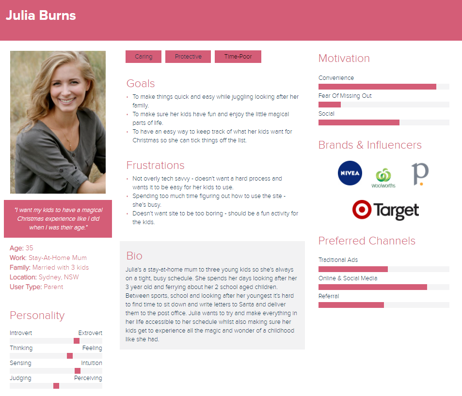
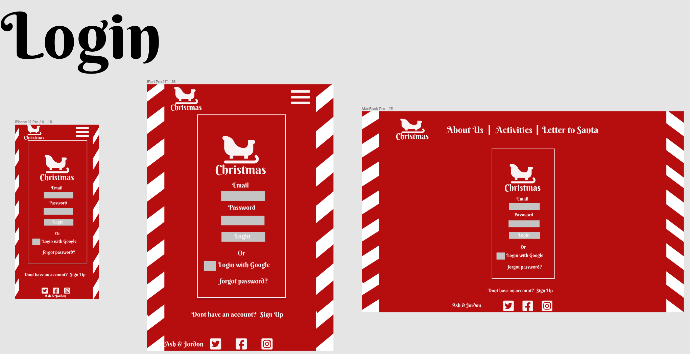
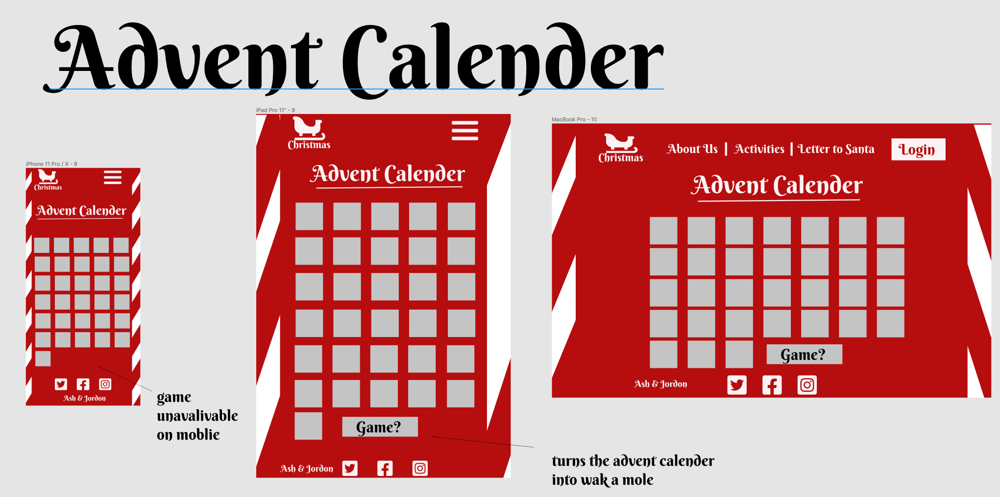

# Ashley Smith and Jordon Goodsir T3A1 - Part A

Santa Site - Part A Documentation

- [Live Site](#)
- [Github Repo](https://github.com/MERN-Project-Santa/Part-A-Docs)

## Table of Contents

- [Description](https://github.com/MERN-Project-Santa/Part-A-Docs#description)
- [Purpose](https://github.com/MERN-Project-Santa/Part-A-Docs#purpose)
- [Functionality/Features](https://github.com/MERN-Project-Santa/Part-A-Docs#functionality--features)
- [Target Audience](https://github.com/MERN-Project-Santa/Part-A-Docs#target-audience)
- [Tech Stack](https://github.com/MERN-Project-Santa/Part-A-Docs#tech-stack)
- [Dataflow Diagram](https://github.com/MERN-Project-Santa/Part-A-Docs#dataflow-diagram)
- [Application Architecture](https://github.com/MERN-Project-Santa/Part-A-Docs#application-architecture-diagram)
- [User Stories](https://github.com/MERN-Project-Santa/Part-A-Docs#user-stories)
- [Wireframes](https://github.com/MERN-Project-Santa/Part-A-Docs#wireframes)
- [Trello Board](https://github.com/MERN-Project-Santa/Part-A-Docs#trello-board)

## Description

### Purpose

### Functionality / features

### Target Audience

### Tech Stack

#### **Front-end**

- HTML
- JavaScript
- CSS
- [React](https://reactjs.org/)
- Any theme libraries

#### **Back-end**

- [Express](https://expressjs.com/)
- [Node.js](https://nodejs.org/en/)

#### **Database**

- [MongoDB](https://www.mongodb.com/)
- [Mongoose](https://mongoosejs.com/)

#### **Deployment**

- [Heroku](https://www.heroku.com/)
- [Netlify](https://www.netlify.com/)

#### **Project Management Tools**

- [Trello](https://trello.com/)
- [Discord](https://discord.com/)

#### **Testing**

- [Cypress](https://www.cypress.io/)
- [Mocha](https://mochajs.org/)

#### **DevOps Tools**

- [git](https://git-scm.com/)
- [GitHub](https://github.com/)
- [Visual Studio Code](https://code.visualstudio.com/)

#### Design Tools

- [Figma](https://www.figma.com/)
- [diagrams.net](https://app.diagrams.net/)

## Dataflow Diagram

## Application Architecture Diagram

## User Stories

### **Stage One** - User Stories:

<strong>Child</strong>

- As a child I want to be able to create a list of gifts I want from Santa.
- As a child I want to be able to write a letter to Santa.
- As a child I want to be able to change my list by adding or removing items

<strong>Parent</strong>

- As a parent I want to be able to add my children.
- As a parent I want to be able to see my childrens gift list.
- As a parent I want to be able to mark presents as bought on my childrens gift list.
- As a parent I want my children to be able to interact with a child-friendly "letter to santa" page.
- As a parent I want to be able to still interact with the normal features of my account.

<strong>Standard User</strong>

- As a user I want to be able to have acces to a navigation bar so I can view the information I want.
- As a user I want to be able to view an about page with information about the websites purpose and goals.
- As a user I want to be able to view a countdown to Christmas page and select my timezone.
- As a user I want to be able to sign up/login and create my own account.
- As a user I want to be able to view the advent calendar.
- As a user I want to be able to interact with the gamified version of the advent calendar.

<strong>Signed In User</strong>

- As a user I want to be able to create a gift list for Christmas to track what presents I want to get.
- As a user I want to be able to delete items from my gift list.
- As a user I want to be able to mark items as purchased from my gift list.
- As a user I want to be able to create a Secret Santa group.
- As a user I want to be able to join a Secret Santa group.
- As a user I want to be able to see who I have to purchase a gift for as a Secret Santa.
- As a user I want to be able to create a wishlist that my Secret Santa can view.

### **Stage Two** - User Personas:

To better understand our target audience User Personas were created so that we could learn more about the goals and needs of our users.

**User Persona - Julia Burns - Parent**:

## Wireframes

## Trello Board

## Authors

Ashley Smith - [GitHub](https://github.com/Ash-Eileen) | [Portfolio](https://ashleysmith.netlify.app/) | [Twitter](https://twitter.com/Ash413_) | [LinkedIn](https://ashleysmith.netlify.app/contact.html)

Jordon Goodsir - [GitHub](https://github.com/JordonGoodsir) | [Portfolio](https://jordongoodsir.netlify.app/) | [Twitter](https://twitter.com/GoodsirDev) | [LinkedIn](https://www.linkedin.com/in/jordon-goodsir-61466a1a5/)
